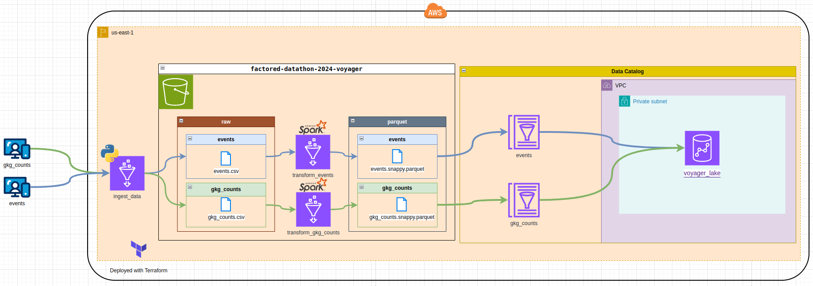
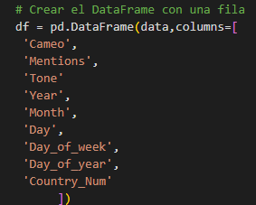

# factored-datathon-2024-voyager

## Overall team goal

Uncover critical insights from global events that allow for early intervention and strategic planning, ultimately helping businesses and organizations navigate complex and volatile environments.

## Specific team goal

Risk Assessment scope to provide early warning insights and predictions to aid in risk mitigation for businesses and organizations facing social, political, and economic uncertainties.

## Overall action plan

Explore global trends/risk assessments across sSocial/political/economic domains so insights enable proactive decision-making and risk mitigation strategies.

## Project milestones/phases

Data Engineering for input
Data Analytics for processing
Machine Learning for processing
Automation for connect the layers
User Interface Dashboard for output

## Deliverable

Public web-based dashboard for risk assessment.

## Stakeholders

Factored and GDELT teams.

## Commited time:

14 days [Aug/12-25/2024]

## Data sources:

* GDELT 1.0 GKG Data
* GDELT 1.0 Events Data

## Infraestructure
Data Infraestructure was deployed using terraform and AWS as cloud provider.
Services used:
VPC
Subnet
Security Groups
S3
Glue Data Catalog
Glue ETL (Apache Spark and Python Shell)
Redshift
IAM Roles

## Resources
Country codes were taken from: https://github.com/gdelt/gdelt.github.io/blob/master/data/LOOKUP-COUNTRIES.json
Cameo Codes were taken from: http://data.gdeltproject.org/documentation/CAMEO.Manual.1.1b3.pdf

## Model Prototyping
To test the model, we utilized Gradio with the script located at /Ml_model_lambda/gradio_test_model.py.

We generated the following link for access: https://0553cda380ccd280c7.gradio.live. This link will remain active for 72 hours.

The model accepts 9 parameters, which represent the following:

in the gradio interface we need to the 9 comma-separated parameters and the output is the risk index

